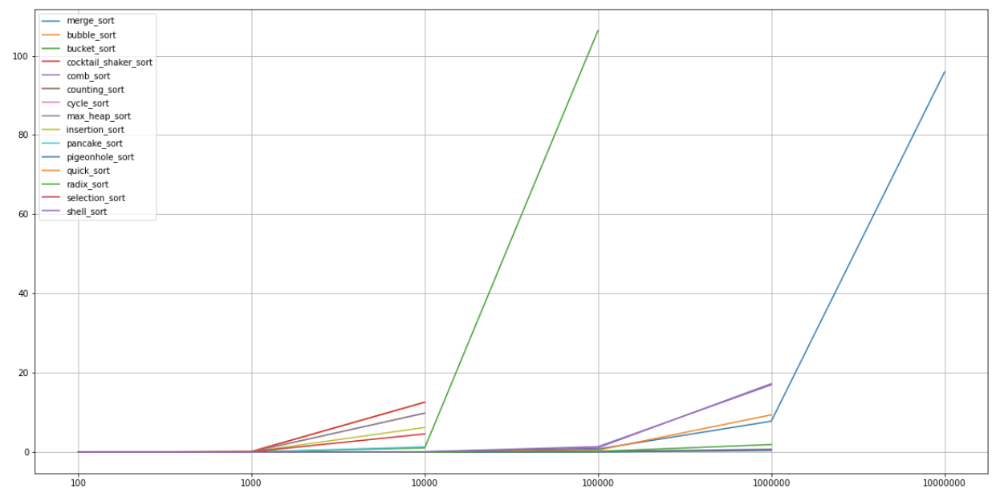

# Teljesítmény

Az alábbi ábrákon láthatóak a könyvtárban található algoritmusok sebeségbeli összemérései 100, 1000, 10000, 100000, 1000000, 10000000 hosszúságú tömbökre másodpercben számolva. A tömbök tartalmai mindig 0 és 10000 közti random értékekkel vannak feltöltve. Azon helyre nincsen adatpont melyeknél a funkció több mint 2 percig futott.

Az első képen minden mért adat látható.

A második képen csak a 20 másodperc alatt futó funkciók láthatóak az olvashatóság kedvéért.

A képekről láthatjuk, hogy a merge_sort, comb_sort, counting_sort, pigeonhold_sort, quick_sort, radix_sort s shell_sort teljesített a legjobban. Ezek komplexitásáról a comb_sort s a shell_sort kivételével elmondható hogy komplexitásuk $< O(n^2)$

Az összes többi funkcióról elmondható hogy komplexitásuk $O(n^2)$ kivéve a max_heap_sort függvényé. Ezek a funkciók mind 2 percnél lassabban futottak le 100000 hosszú tömbökre, így ha a gyorsaság egy használhatósági szempont akkor nem érdemes őket használni. 

Ezzel szemben a gyorsabb funkciók közül néhánynak extra memóriaigénye van (pl.: merge_sort). Mások pedig nem lesznek konzisztensen gyorsak, mint pl.: quicksort mely legroszabb esetben $O(n^2)$ idő alatt fut le.