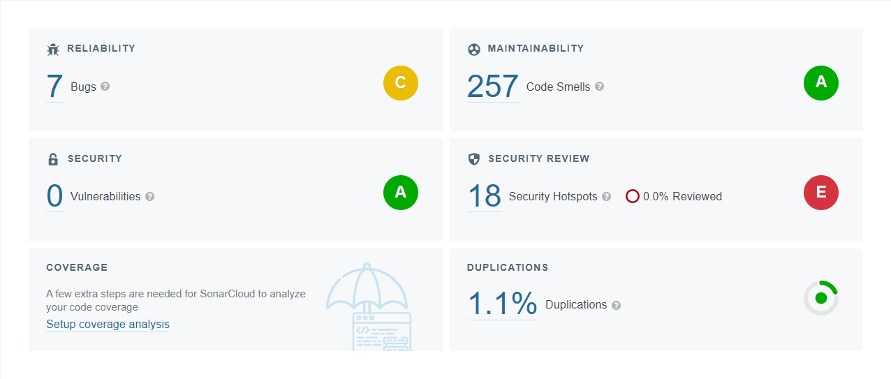
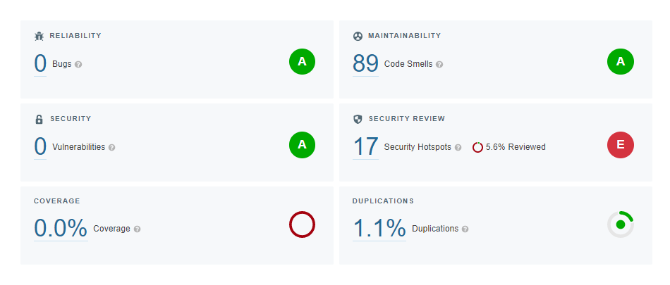

# Statikus analízis

A feladathoz kapcsolódó issue: [#4](https://github.com/BME-MIT-IET/iet-hf-2022-holnapejfeligszerintemmindlepjunkbe/issues/4)

Ezen feladat során a SonarCloud statikus kód analízis eszköz került felhasználásra.
Az általunk választott létező projekt leírásában nem találtuk nyomát, hogy statikus analízis eszköz használatra került volna, így érdekesnek találtuk a használatát.

## SonarCloud inicializálása

A SonarCloud a gitHub Actions opcióján belül a workflow-ba került bele. Ennél a hivatalos leírásuk került követésre.

A beállítás során kicsit játszottunk a lehetőségekkel, mint például adott branch-en való futásának megadása, így elkerülve azt hogy a SonarCloud integrálása során más ágakon való munka során, amíg nem végleges a beállítás ne fusson le. A gitHub Actions felület teleszemetelése így elkerülhető, ha esetleg hibás config miatt egyes build folyamatok hibával záródnának.

## SonarCloud

A SonarCloud felületén egyből visszajelzést kaptunk a  projektet érintő problémákról, miután kaptunk jogokat a használatához. A felmerült kezdeti állapotot a következő ábra szemlélteti:

Meglepetten tapasztaltuk, hogy csak 7 bug-ot kaptunk, miközben egy olyan projekről beszélünk, amely több ember kontribúciójával készült, és mint kifejtettük nem találtuk nyomát hogy statikus analízis eszközt használtak volna.

Két problémát emelnénk ki, amelyek egyike bug-ként került elő. A második komolyabb implementációs probléma, pedig codesmell-t vizsgálva került napvilágra.

### Python .sort() függvényének nem megfelelő használata

Issue: [#comment](https://github.com/BME-MIT-IET/iet-hf-2022-holnapejfeligszerintemmindlepjunkbe/issues/4#issuecomment-1128860510)

A .sort() függvényt egy tesztesetben hibásan használva azt feltételezte a készítő, hogy visszadja a rendezet array-t, pedig helyben rendez. Ezt az elvárt és meglévő eredményen is használva a teszt mindig jól futthatot le, mivel none volt a visszatérésük. 

Ezzel a problémával kapcsolatban az eredeti repo felé is jelzést adtunk: [#link](https://github.com/keon/algorithms/pull/865)

### Hibásan implementált algoritmus

Issue: [#comment](https://github.com/BME-MIT-IET/iet-hf-2022-holnapejfeligszerintemmindlepjunkbe/issues/4#issuecomment-1128830815)

A string-ekkel kapcsolatos algoritmusok között találtunk egy implementációs problémákkal küzdőt, amely a meake_sentence.py nevű állományban található. Működését ezen rövid dokumentumban nem fejtenénk ki, de egy szám értéket kellene visszaadnia, de csak true értéké törénik. Ezt egy codesmell-ként látta meg a SonarCloud, és további nyomozás után jöttünk rá több próblémára.

### Összegzés

A SonarCloud további jelzéseit nem fejtenénk ki pontosan, de jó részüket orvosoltuk, valmint rengeteg false positive esettel találkoztunk. Ezek nagy része ettől eltekintve hasznosnak tekinthetőek, mert nagyrész tervezői megfontolásokból adódnak, vagy szakterület specifikus konvenciókból. 

Záró helyzet a SonarCloud-ban:

Látható, hogy a problémák nagy részét átnéztük. A mostani statisztika szerinti hibák állását 0-ra is redukálhattuk volna, de rengeteg ugyan olyan típusú hiba átnézését igényelte volna, de mi ezekből csak 1-2 mintát néztünk meg. 

## Tanulság

Betekintést kaptunk mennyire is fontos statikus analízis eszközök használata, amivel akár egyszerű codesmell-ből kiindúlva is nagyobb problémát tudunk felfedni. A feladat során olyan tapasztolatokat kaptunk, amelyek a jövőbeli munkánk során nagy hasznot fognak jelenteni számunkra. Azt hogy az eredeti repo felé is lett alkalmunk hibát jelezni és megismerni a működését találtuk az egyik leghasznosabbnak.